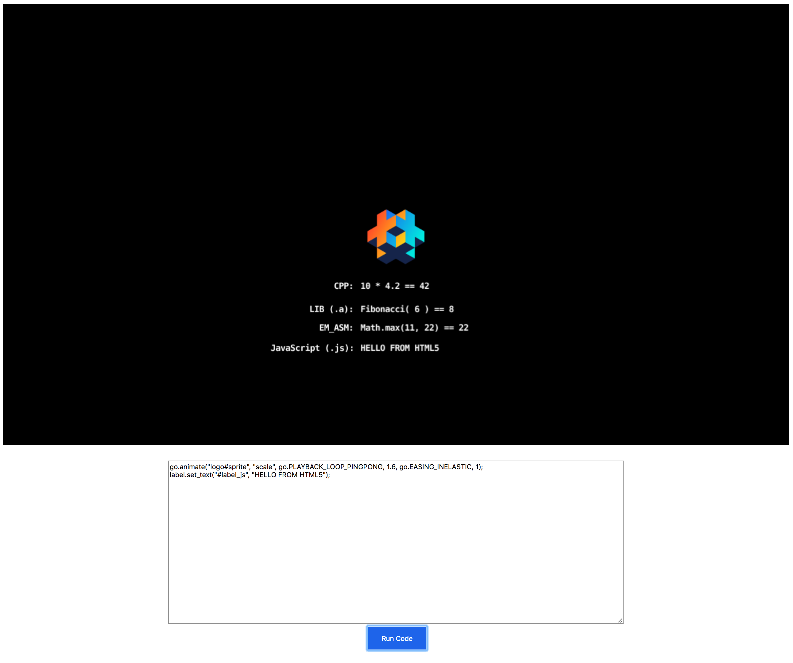

# HTML5 Native Extension

## Features

This is a short example of what features the native extension brings for the HTML5 platform

* C/C++ - Add pure C/C++ code or C/C++ libraries built with Emscripten

* [EM_ASM](https://kripken.github.io/emscripten-site/docs/porting/connecting_cpp_and_javascript/Interacting-with-code.html#interacting-with-code-call-javascript-from-native) - Add "in place" JavaScript code directly in your C/C++ code

* JavaScript libraries - Add Emscripten JavaScript libraries. These are JavaScript files with special "hooks" that the Emscripten compiler will react to and merge with the final executable

## Emscripten

[Emscripten](https://kripken.github.io/emscripten-site/docs/) is a Clang based compiler that allows for compiling existing C/C++ code into JavaScript and WebAssembly.

## Example app

The example app demonstrates these features, and also shows an example of how to pass information to the running game.

